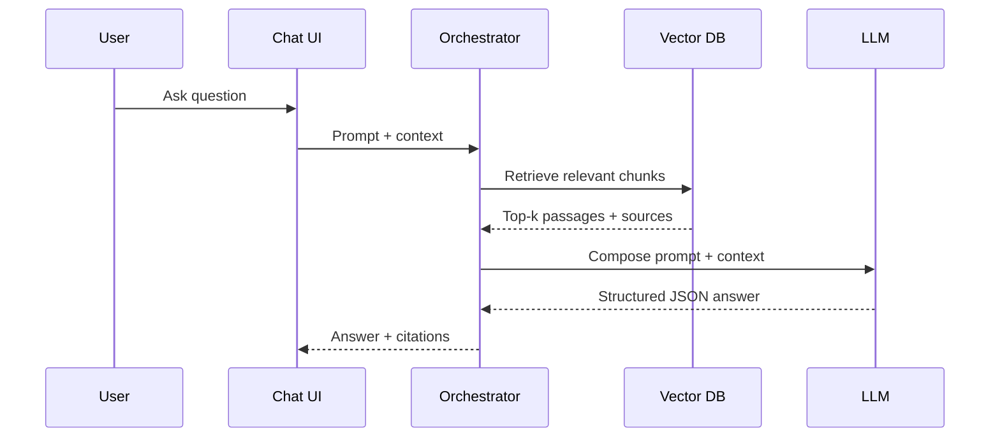
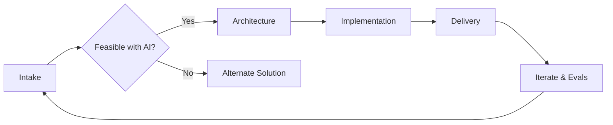
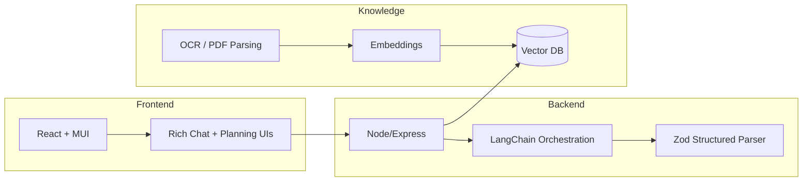

## 1) AI Capability Overview — Our Team

- We design, build, and ship AI systems end-to-end (prompts, parsers, data pipelines, UI).
- Capable of multimodal analysis, deterministic outputs, retrieval, guardrails, and observability.
- Proven delivery: from problem framing to production launch.
- Screenshot: Title/Architecture overview.


## 2) From Capability to Product: BuildWise

- Built an AI-enabled construction management product: planning, analysis, rich chat, and budgeting.
- Combines customer requirements, plan analysis, and trade workflows into actionable outputs.
- Showcases our approach to context engineering and reliable structured responses.
- Screenshot: BuildWise home/overview.


## 3) System Overview

- LLM Orchestration: LangChain with structured output enforcement.
- Deterministic Parsing: Zod schemas to guarantee correct JSON shape.
- Knowledge Center: OCR + PDF extraction → chunking → embeddings → vector search.
- RAG: Retrieve relevant chunks with sources; cite evidence.
- Rich UI: Structured chat responses (tables/options/follow-ups); planning + budget flows.
- Screenshot: High-level architecture diagram.

```mermaid
flowchart LR
  U[User] --> CH(Chat & Planning UI)
  CH -->|Prompt + Context| ORCH[LLM Orchestration]
  ORCH -->|Deterministic JSON| PARSER[Zod Structured Parser]
  ORCH -->|Retrieve| RAG[(Vector DB)]
  SUBGRAPH Knowledge Center
    ING[OCR/PDF Extract] --> CHUNK[Chunk + Metadata]
    CHUNK --> EMB[Embeddings]
    EMB --> RAG
  END
  PARSER --> RESP[Rich Structured Response]
  RESP --> CH
```


## 4) Prompts Library

- Centralized prompt keys for consistent authoring and reuse per workflow/trade.
- Template variables and actions (analyze/compare/generate) with role/context guidance.
- Versionable and testable prompts; agent-specific tuning.
- Screenshot: Prompts admin/listing screen.


## 5) Deterministic Output Parser (Structured JSON)

- Zod + LangChain `withStructuredOutput` to enforce strict schema.
- Required fields by contract; nullable/defaults for optionality.
- Schema: answer, comparisons (tables), options (cards), followUps, sources.
- Backward compatibility: normalization when legacy fields differ.
- Screenshot: Zod schema snippet and rendered rich response.


## 6) Knowledge Center: OCR and PDF Extraction

- Multi-modal ingestion: PDFs (plans/specs) and images.
- OCR and parsing (incl. LlamaParse) → clean text + structural metadata.
- Chunking with metadata (home/trade/doc/page) for targeted retrieval.
- Vector index with embeddings for semantic search.
- Screenshot: Knowledge ingest log and document list.

```mermaid
flowchart TD
  SRC[PDFs / Images] --> OCR[OCR / Parsers]
  OCR --> CLEAN[Normalize + Structure]
  CLEAN --> CHUNK[Chunking + Metadata\n(home/trade/doc/page)]
  CHUNK --> EMB[Embeddings]
  EMB --> VDB[(Vector Index)]
```


## 7) Retrieval-Augmented Generation (RAG)

- Build queries from user prompt + selected documents/context.
- Retrieve top-k semantic chunks; pack context window with sources.
- Answers return citations; UI shows source titles/links.
- Screenshot: Chat response with sources; “View source” demo.




## 8) Customized Chat Window (Rich, Structured UI)

- Structured JSON → UI renders tables (comparisons), option cards (pros/cons/attributes/cost), follow-up question chips.
- Event-driven UX: clicking follow-ups sends templated prompts; easy workflow chaining.
- Multimodal: Optionally include images/PDFs for plan analysis.
- Screenshot: Chat UI with comparisons, options, and follow-ups.


## 9) Plan Analysis + Requirements Fusion

- Architecture Analysis: detect rooms, areas, and metadata from plans.
- Trade Planning (e.g., HVAC): zones, capacity (tons), cost ranges, brand guidance.
- Merge explicit customer requirements to tailor options and recommendations.
- Screenshot: Planning screen showing detected rooms and trade recommendations.

```mermaid
flowchart LR
  REQ[Customer Requirements] --> FUSE[Context Fusion]
  PLAN[Plan Analysis\n(rooms, areas, metadata)] --> FUSE
  FUSE --> PLAN_SUM[Planning Summary\n(selections, zones, capacity)]
  PLAN_SUM --> COST[Planned Cost Range]
  PLAN_SUM --> TRADE{Per-Trade Data}
  COST --> TRADE
```


## 10) Budget and Trade Financials

- Per-trade planned cost range (from planning) vs. actual price; bids/contracts/invoices tracking.
- Dedicated Budget page: bid comparison (PDFs), contracts upload, invoice management, payment status.
- Trade detail “3-step” header: Planning → Budget → Execution navigation.
- Screenshot: Budget overview and Trade Budget detail.


## 11) Context Engineering Methodology

- Intake: Collect problem, goals, constraints, and available data.
- Feasibility: Validate if AI is the right tool; align on success metrics.
- Architecture: Models, retrieval (RAG), parsers, orchestration, guardrails.
- Implementation: Prompts + structured outputs + data pipelines + rich UX.
- Delivery: Evals, telemetry, cost controls, iteration loop.
- Screenshot: Method checklist.




## 12) Enterprise Readiness

- Observability: AI logs, prompts/outputs, latency/cost dashboards.
- Evals: Scenario tests to prevent regressions in structured outputs and accuracy.
- Security/Privacy: Scoped data access, source tracking, PII handling options.
- Cost & Performance: Caching, retrieval tuning, structured outputs to reduce retries.
- Screenshot: Logs/evals dashboard mock.


## 13) Industry Use-Case Alignment (Examples)

- Operations & Quality: SOP retrieval, deviation analysis, structured checklists.
- Procurement & Bids: Side-by-side comparisons, requirement matching, lifecycle cost.
- Service & Maintenance: Multimodal troubleshooting (images/manuals) with cited steps.
- Metrics: Time-to-answer, citation coverage, task completion accuracy.
- Screenshot: Example comparison table tailored to a target process.


## 14) Tech Stack Summary

- Backend: Node/Express, LangChain, Zod for structured outputs, Joi for REST validation.
- Knowledge: OCR/PDF parsing (incl. LlamaParse), vector index for embeddings/RAG.
- Frontend: React + MUI; rich structured chat renderers; planning and budget UIs.
- Integrations: Event-driven prompts, multimodal analysis, bid comparison flows.
- Screenshot: Stack diagram.




## 15) Next Steps

- Select pilot scope and data sources; define KPIs and acceptance criteria.
- Configure ingestion and RAG domains; tailor prompts and schemas.
- Run evaluations; iterate on UX and guardrails; plan rollout.
- Screenshot: Project plan/timeline.


